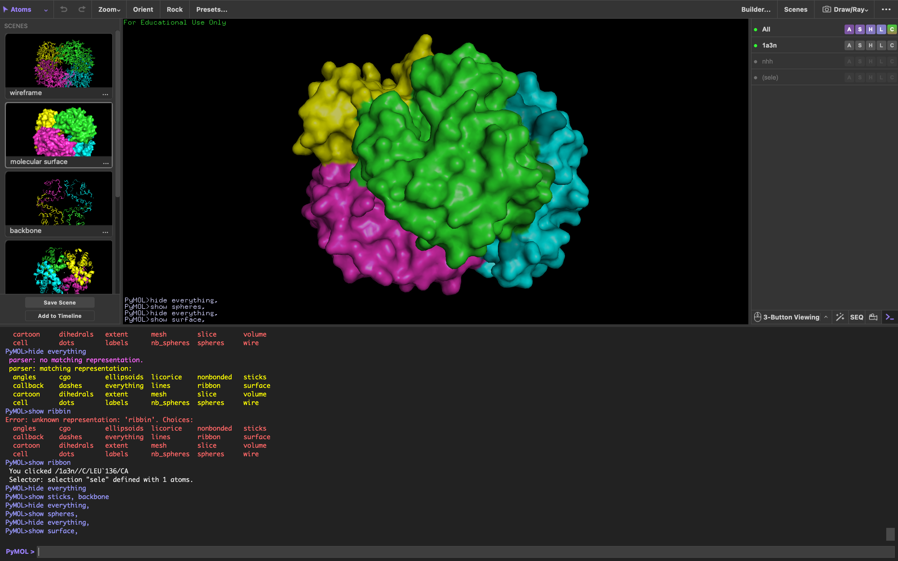
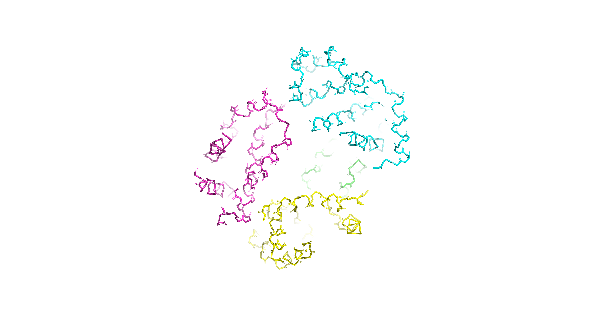
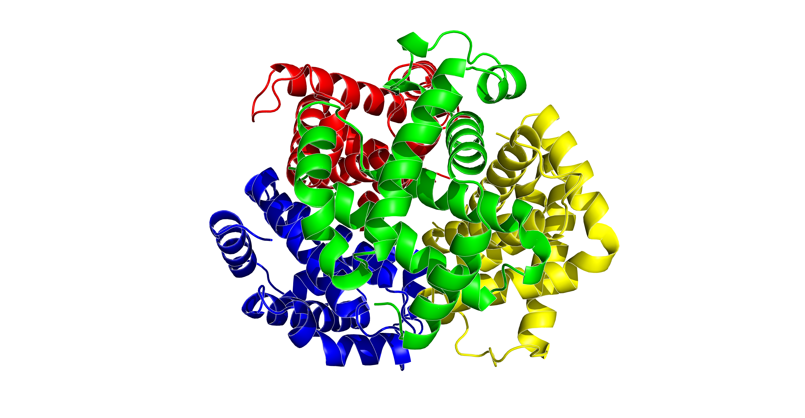

## Выбранное ПО: PyMOL
Ссылка https://pymol.org/

Выбранный белок: 1A3N https://www.rcsb.org/structure/1A3N

## Использование PyMOL
Для открытия файла используем стандартное меню File -> Open -> выбираем наш файл .pdb


Для получения разных визуализаций и создания изображений используем командную строку внизу интерфейса 


Все картинки получены командой 
```
2 set ray_trace_mode, 1 ray 4000, 2080 png filename.png, dpi=300
```
## Полученные изображения
### Wireframe

```
hide everything
show lines
```

### Backbone

```
hide everything  
show sticks, backbone
```

### Spacefill

```
hide everything
show spheres
```

### Ribbons

```
hide everything
show cartoon
```

### Molecular surface

```
hide everything
show surface
```

### CPK

```
util.cbc
```

### Chains

```
color red, chain A
color blue, chain B
color yellow, chain C
color green, chain D
```
