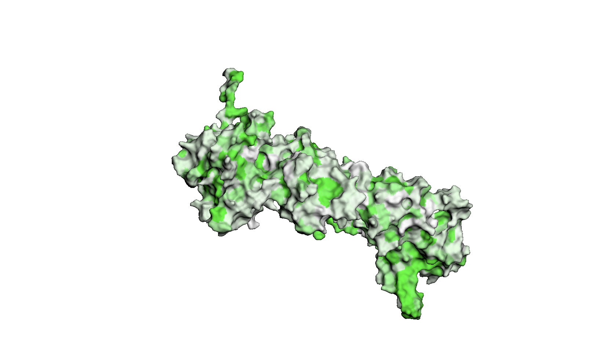
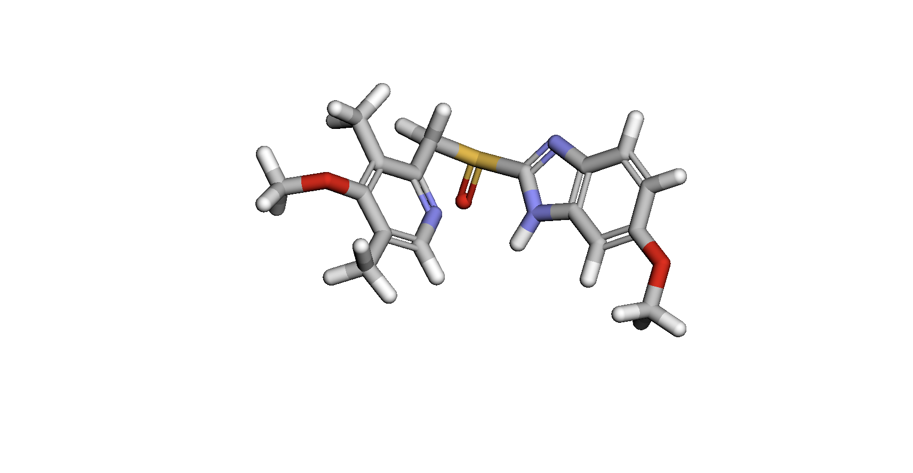
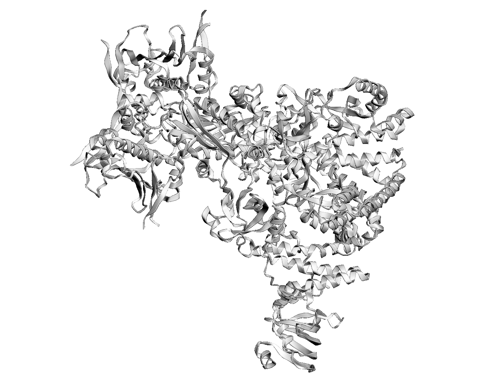
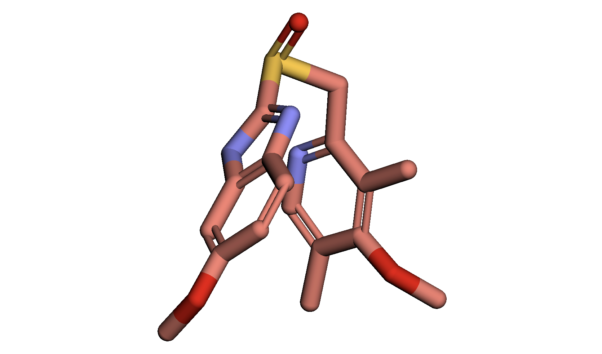

1. Информация о препарате Омепразол

a. Действующее вещество:
Омепразол (Omeprazole)
Химическая формула: C17H19N3O3S
Структурная формула (по вашему описанию SMILES): COC1=CC2=C(C=C1)N=C(N2)S(=O)CC1=NC=C(C)C(OC)=C1C

b. Область применения:

Препарат относится к группе ингибиторов протонной помпы (ИПП).
Применяется при:
Гастроэзофагеальная рефлюксная болезнь (ГЭРБ)
Язвенная болезнь желудка и двенадцатиперстной кишки
Профилактика и лечение повреждений слизистой, связанных с нестероидными противовоспалительными препаратами (НПВП)
Синдром Золлингера–Эллисона

c. Молекулярный механизм действия (кратко):
Омепразол необратимо ингибирует H⁺/K⁺-АТФазу париетальных клеток желудка, блокируя секрецию желудочной кислоты.
Механизм: препарат в кислой среде превращается в активный сульфенамид, который ковалентно связывается с тиоловыми группами фермента, предотвращая транспорт протонов в просвет желудка.

2. Ноутбук: omeprazol.ipynb
Полученные результаты:

  

