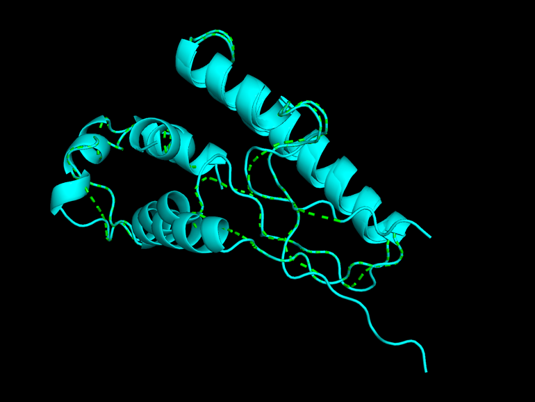
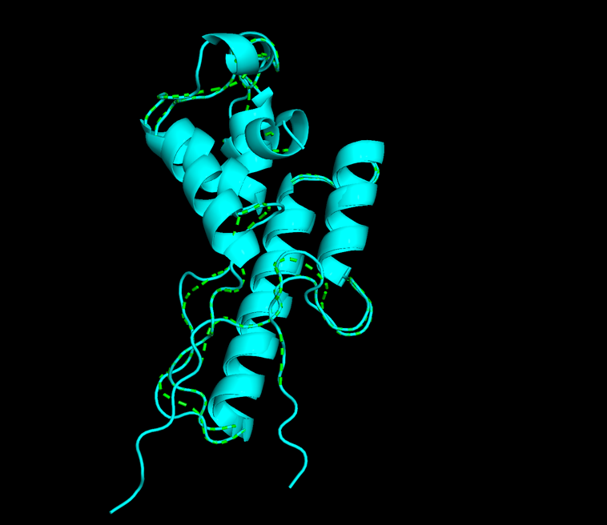

Использованные ноутбуки - папка notebooks

Результаты работы ноутбуков - папка predictions

Результаты выравнивания - папка aligned

В результате проведенного структурного выравнивания и последующей визуализации обе предсказанные третичные структуры оказались очень похожи друг на друга. При визуализации с раскраской по цепям видно, что основные элементы вторичной и третичной структуры хорошо совмещаются. Небольшие отклонения могут наблюдаться, что объясняется особенностями алгоритма предсказания, однако в целом совпадение структур высокое.

